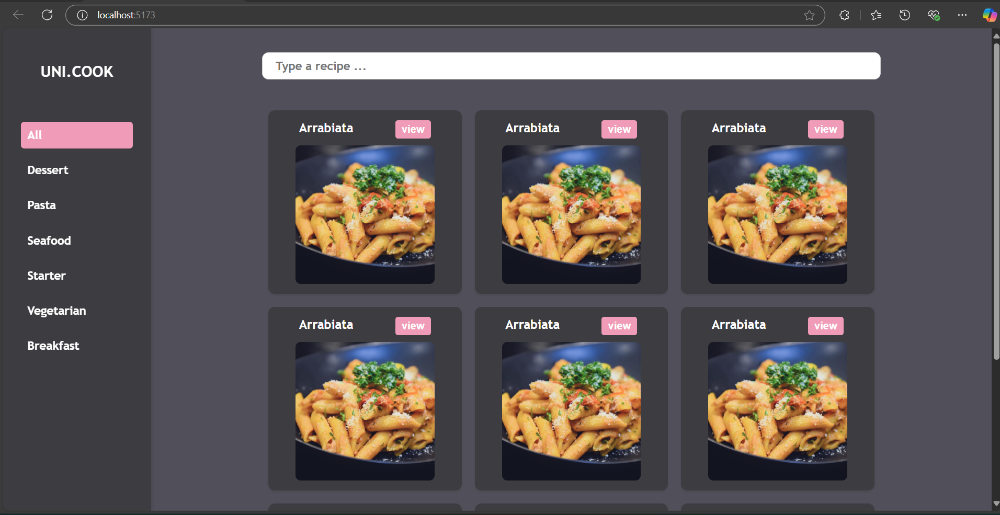

# Food Recipes  
The following project consists of a food recipe search engine, where the user can type in a recipe and thanks to an external api, be able to find it.

This is the first step, it means, it's not completed

### Technologies used:  
- Express
- Node
- React  
  
### Steps to run the proyect  
  
1. Clone the Repository with:  
```git
    git clone https://github.com/JuanSilva2000/PAM.git
```
  
2. Install the dependecies used to the backend:  
```git
    npm install
```

3. Run the backend:  
```git
    npm run dev
```

4. Open a new terminal and move to frotend file and install its dependecies
```git 
    cd frontend  
    npm install
```  
  
5. Run the frontend and open in the browser the localhost in the given port:  
```git  
    npm run dev
```   
  
## Browser result  

